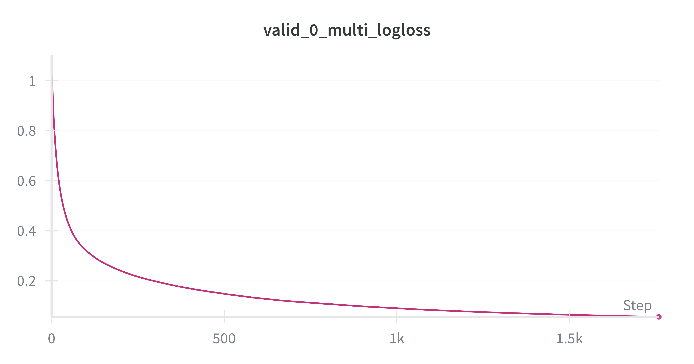

# Satellite Analysis and ML

This repository contains the source code for a satellite data analysis, with a focus on Colombian towns and regions, currently under process, the goal is to fetch data from open data collections ( in particular Copernicus/Sentinell data collections )

## Features

- **Data Fetching**: Module for retrieving and processing satellite data.
- **Training Models**: Includes scripts for training machine learning models to detect anomalies.
- **Validation**: Tools for validating the effectiveness of the models.
- **Utilities**: Various utilities supporting data handling and model operations.

## Installation

Clone the repository and install the required packages (`uv` package manager required):

```
git clone https://github.com/afhuertass/sat-an.git
cd sat-anomaly
uv sync
cd src
```

## Usage

Instructions on how to use the system will be provided here, detailing how to run the scripts and use the models.

### data fetching:

run for example:

```bash
uv run sat-an.py ingest la-plata 2025-01-01 2025-01-30
```

This requires an account in `https://dataspace.copernicus.eu/` so authentication there is needed to fetch the data.

In the previous command, we fetch the satellite data for the colombian town of `La Plata` the code uses a GeoPandas region defined in a file, computes de spectral indices and stores the netcdf file. There is a '--cloud' option to store the data in a bucket (it requires cloud setup, instructions to come)

### Training models

The training data is coming from the Colombian department of statistics (DANE). I was able to find the soil usage classification for the whole country for the year 2017. The training data consist then in these labels (that can be found in the `data/soil_use_labels.parquet`) and the spectral index data that is coming from Sentinel satelites. To simplify a bit I average the spectral index data, in the time dimention from June to September ( this is arbitrary choice of mine) and then assign the labels from DANE.

the training experiment can be launched, fetching training data first, and then running:

```bash
uv run sat-an.py ingest la-plata 2017-06-01 2017-09-30 --cloud
uv run python sat-an.py train la-plata -p model_type=lgb
```

Add a `.env` file to the root `src/.env` to have some key to Wandb to long the experiments there:

```
WANDB_API_KEY=5eb20XXXXXXXXXXX
PROJECT_ID="google-cloud-project-id"
REGION="europe-north1"
```

As an example the output in Weights and biases


### Inference

Comming soon

### Model serving

Comming soon

### Training clusters:

This project uses skypilot to launch machine learning jobs on the Cloud. There is need to create a GKE cluster, after the gcloud is properly configured (recommended to create a service account and assign the permissions found in `skypilot-role.yaml`)
:

```bash
export CLUSTER_NAME="testcluster"
gcloud container clusters create "$CLUSTER_NAME" \
  --project "$PROJECT_ID" \
  --zone europe-north1-a \
  --num-nodes 2 \
  --machine-type e2-small
```

This creates a very small cluster, more advances options can include a pool of GPU ready pods, Google managed clusters and more. Running clusteers incurr in compute costs. The interesting bit about skypilot is that this cluster needs not to be in GCP, it could be self hosted or in any other cloud. Cloud resources can greate costs, so be mindful of shutting down clusters not in use

Then the `kube.config` can be fetched from the cloud and put in the right place:

```bash
gcloud container clusters get-credentials "$CLUSTER_NAME" --region europe-north-a
```

Make sure the sky has enabled the clouds:

```bash
sky check
```

Should show the GCP and Kubernetes clouds activated.

## License

This project is licensed under lahe MIT License - see the [LICENSE](LICENSE) file for details.
